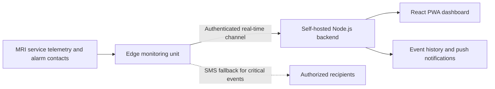
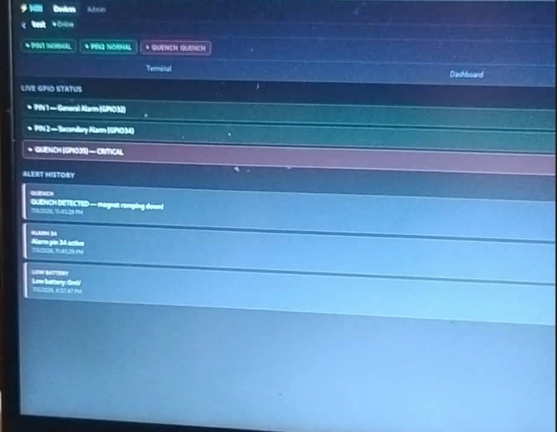
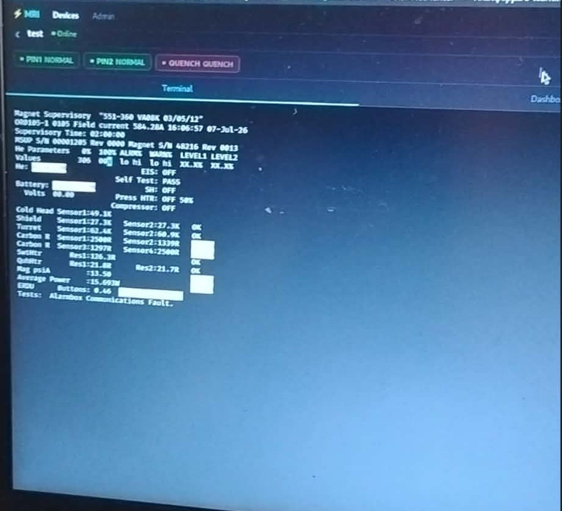
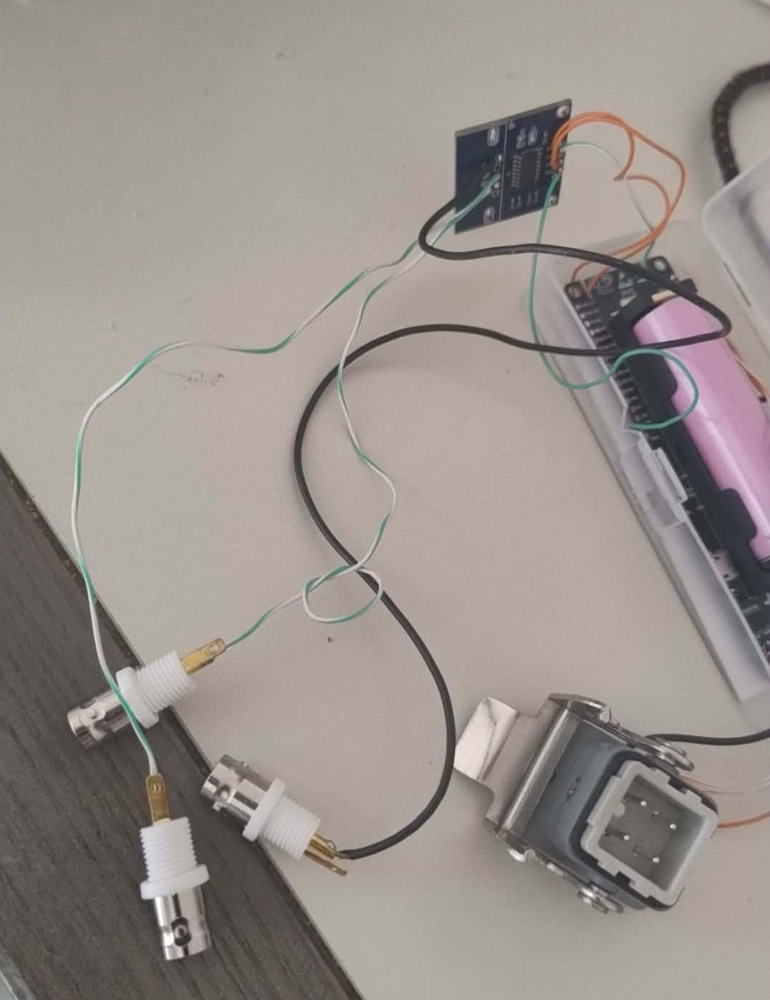
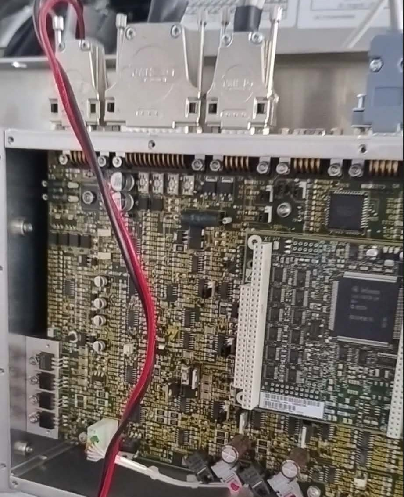

# MRI Remote Magnet Monitor

An end-to-end engineering prototype for remotely observing MRI magnet-support telemetry and alarm signals. The system combines embedded hardware, real-time communications, a self-hosted backend, and an installable web dashboard to help authorized technical staff assess equipment status without continuous physical presence near the scanner room.

> **Portfolio scope:** environment-specific credentials, network identifiers, and deployment archives are intentionally excluded or replaced with placeholders. See [SECURITY.md](SECURITY.md) for deployment boundaries.

## Why I built it

MRI magnet infrastructure requires continuous awareness of critical equipment states. Access is constrained by the RF-shielded environment, while commercial remote-monitoring solutions can be costly and closed. My goal was to explore a practical, self-hosted monitoring architecture using accessible hardware and modern web technologies.

The prototype focuses on equipment telemetry and alarm states only; it is not designed to process patient data.

## System architecture

The edge unit collects serial service telemetry and selected alarm-contact states through interface circuitry. It forwards live information to the backend and can use the cellular modem for SMS alerting when the primary data path is unavailable.

## What I implemented

- Embedded firmware for telemetry acquisition, alarm-state monitoring, input debouncing, reconnection, heartbeat handling, and local provisioning.
- A Node.js/Express backend with SQLite persistence, authenticated WebSockets, JWT-based sessions, and role-based access control.
- Multi-site data separation through company, administrator, technician, and device-level authorization models.
- A React progressive web app with live status indicators, equipment-data parsing, alarm history, and an xterm.js terminal view.
- Web Push notifications for important state changes and SMS fallback for critical alarm delivery.
- Reverse-proxy and self-hosted deployment experiments on a Linux VPS.

## Functional prototype demonstration

### Real-time alarm dashboard

The dashboard presents live alarm-contact states and a timestamped event history. The photograph below shows a controlled critical-alarm test reaching the web interface in real time.

### Live service telemetry

Raw service telemetry is streamed to the browser terminal so that a technician can inspect the original equipment output alongside parsed status information.

### Edge interface prototype

The hardware prototype combines the embedded controller, interface modules, connection adapters, and the test connection used during supervised development.

| Prototype interface and adapters | Supervised test connection |
|---|---|
|  |  |

## Demonstrated results

- Live service telemetry was transported from the edge device to the browser interface.
- Raw terminal data and parsed status information were displayed simultaneously.
- Controlled alarm-input changes appeared in real time and were stored in the event history.
- User roles and company boundaries were enforced by both REST and WebSocket paths.
- Connection loss was detected through heartbeat monitoring, with automatic recovery attempts.

## Technology stack

| Layer | Technologies |
|---|---|
| Edge firmware | ESP32-class controller, LilyGO T-A7670E, C++/Arduino |
| Communications | Serial telemetry, GPIO alarm inputs, secure WebSockets, SMS |
| Backend | Node.js, Express, SQLite, `ws`, JWT, Web Push |
| Frontend | React, Vite, PWA/service worker, xterm.js |
| Infrastructure | Linux VPS, Nginx, TLS reverse proxy |

## Engineering considerations

- **Fail-safe visibility:** raw telemetry remains available alongside parsed values so technicians can verify interpretation.
- **Intermittent connectivity:** heartbeat detection, reconnection logic, and an independent SMS path reduce reliance on a single transport.
- **Access boundaries:** device, company, administrator, and technician roles are separated in the backend.
- **Maintainability:** the project is separated into firmware, backend, frontend, and infrastructure layers.

## Repository structure

- `firmware/` — embedded firmware and provisioning logic
- `server-v2/` — current Node.js backend
- `webapp/` — React PWA and production build
- `proxy/`, `nginx-setup/` — reverse proxy and infrastructure configuration
- `deploy/` — deployment packaging and setup scripts
- `server/`, `webapp-v1-backup/` — earlier prototype iterations

## Project status

Functional engineering prototype developed during a biomedical equipment internship and evaluated in a supervised technical environment. The next phase would include production-grade isolated interface hardware, automated tests, structured observability, security hardening, and formal validation before any operational deployment.

## Important notice

This project is an independent educational and engineering prototype. It is not a certified medical device, is not affiliated with or endorsed by any MRI manufacturer, and must not replace OEM monitoring, safety systems, service procedures, or qualified technical personnel.

Copyright © 2026. All rights reserved. No license to reproduce, deploy, or commercially use the implementation is granted.
